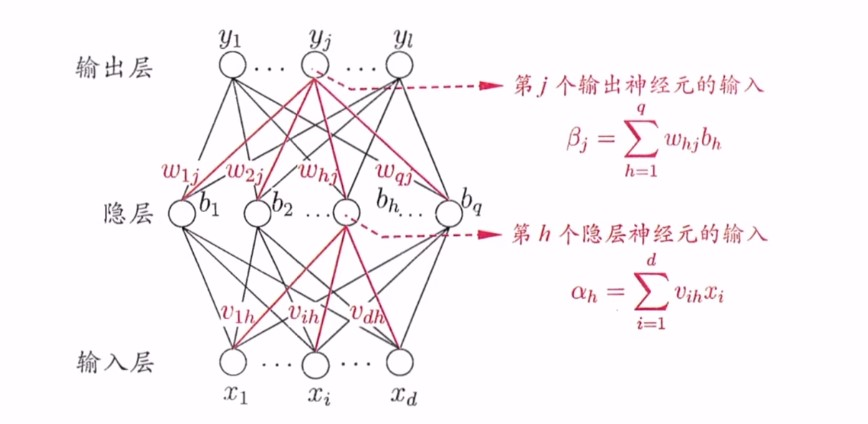

# 神经网络

## M-P 神经元

接受 $n$ 个输入（通常来自其他神经元），并给各个输入赋予权重计算加权和，然后和自身特有的阈值 $\theta$ 进行比较，最后经过激活函数处理得到输出。

$$
y = f(\sum_{i=1}^n w_ix_i - \theta) = f(w^Tx + b)
$$

单个 M-P 神经元：感知机（sgn作激活函数）、对数几率回归（sigmoid作激活函数）

多个M-P神经元：神经网络

## 感知机

激活函数为sgn（阶跃函数）的神经元

$$
f(\mathbf{x}) = \text{sign}(\mathbf{w}^\top \mathbf{x} - \theta) = 
\begin{cases} 
1, & \mathbf{w}^\top \mathbf{x} - \theta \geq 0 \\
0, & \mathbf{w}^\top \mathbf{x} - \theta < 0 
\end{cases}
$$

其中，$x \in \mathbb{R}^n$ 为样本的特征向量，是感知机模型的输入，$w$，$\theta$ 是感知机模型的参数，$w \in \mathbb{R}^n$ 为权重，$\theta$ 为阈值。

从几何角度来说，给定一个线性可分的数据集 $T$，感知机的目的是求得能对数据集 $T$ 中的正负样本完全正确划分的超平面。

### 学习策略

假设此时误分类样本集合为 $M \in T$，对任意一个**误分类**样本 $(x,y) \in M$ 来说，当 $\mathbf{w}^\top \mathbf{x} - \theta \ge 0$ 时，模型输出值为 $\hat{y} = 1$，样本真实标记为 $y=0$ ；反之，当 $\mathbf{w}^\top \mathbf{x} - \theta \le 0$ 时，模型输出值为 $\hat{y} = 0$，样本真实标记为 $y=1$。综合两种情形可知，以下公式恒成立：

$$
(\hat{y} - y)(\mathbf{w}^\top \mathbf{x} - \theta) \ge 0
$$

所以，给定数据集 $T$，其损失函数可以定义为：

$$
L(w,\theta) = \sum_{x \in M} (\hat{y} - y)(\mathbf{w}^\top \mathbf{x} - \theta)
$$

显然，此损失函数是非负的。如果没有误分类点，损失函数值为0。而且，误分类点越少，误分类点离超平面越近，损失函数值越小。

具体地，给定数据集

$$
T = \{ (x_1,y_1), (x_1,y_1), \cdots, (x_N,y_N) \}
$$

其中 $x_i \in \mathbb{R}^n$，$y_i \in \{ 0,1 \}$，求参数 $w$, $\theta$，使其为极小化损失函数的解：

$$
\min_{w,\theta} \; L(w, \theta) = \min_{w,\theta} \; \sum_{x_i \in M} (\hat{y_i}-y_i)(w^Tx_i - \theta)
$$

其中 $M \subseteq T$ 为误分类样本集合。若将阈值 $\theta$ 看作一个固定输入为1的哑节点（维度扩充），即：

$$
- \theta = -1 \cdot w_{n+1} = x_{n+1} \cdot w_{n+1}
$$

简化为：

$$
\min_{w} L(w) = \min_{w} \sum_{x_i \in M} (\hat{y_i}-y_i)w^Tx_i
$$

### 学习算法

当误分类样本集合 $M$ 固定式，那么可以求得损失函数 $L(w)$ 的梯度为：

$$
\nabla_w L(w) = \sum_{x_i \in M} (\hat{y_i}-y_i)x_i
$$

感知机使用随机梯度下降法，一次随机选取一个误分类点使其梯度下降。所以更新公式为：

$$w \leftarrow w + \Delta w$$
$$\Delta w = - \eta(\hat{y_i}-y_i)x_i = \eta(y_i - \hat{y_i})x_i$$

感知机只能解决线性可分问题。

## 神经网络

### 多层前馈网络

每层神经元与下一层神经元全互连，神经元之间不存在同层连接，也不存在跨层连接。(隐层阈值 $\gamma_h$，输出层阈值 $\theta_j$ )

将神经网络看作一个特征加工函数

$$
x \in \mathbb{R}^d \rightarrow NN(x) \rightarrow y = x^* \in \mathbb{R}^l
$$

回归：后面接一个 $\mathbb{R}^l \rightarrow \mathbb{R}$ 的神经元，例如：没有激活函数的神经元

$$
y = w^Tx^* + b
$$

分类：后面接一个 $\mathbb{R}^l \rightarrow [0,1]$ 的神经元，例如：激活函数为sigmoid函数的神经元

$$
y = \frac{1}{1 + e^{-w^Tx^* + b}}
$$

在模型训练的过程中，模型自动学习提取有用的特征。

损失函数：
- 回归任务：均方误差
- 分类任务：交叉熵

### 误差逆传播算法（BP）

神经网络的输出为：

$$
\hat{y}^k = f(\beta_j - \theta_j)
$$

网络在 $(x_k,y_k)$ 上的误差为：

$$
E_k = \frac{1}{2} \sum_{j=1}^l (\hat{y}_j^k - y_j^k)^2
$$

基于随机梯度下降的参数更新算法

$$w \leftarrow w + \Delta w$$
$$\Delta w = - \eta \Delta_w E$$

其中只需要推导出 $\Delta_wE$ 这个损失函数 $E$ 关于参数 $w$ 的一阶偏导数（梯度）即可（链式求导）。由于 $NN(x)$ 通常是极其复杂的非凸函数，不具备像凸函数这种良好的数学性质，因此随机梯度下降不能一定保证走到全局最小值点，更多情况下走到的都是局部极小值点。

推导：

$w_{hj}$ 先影响第 $j$ 个输出层神经元的输入 $\beta_j$ ，再影响到其输出值 $\hat{y}_j^k$，然后影响到 $E_k$，有：

$$
\frac{\partial E_k}{\partial w_{hj}} = \frac{\partial E_k}{\partial \hat{y}_j^k} \cdot \frac{\partial \hat{y}_j^k}{\partial \beta_j} \cdot \frac{\partial \beta_j}{\partial w_{hj}}
$$

根据 $\beta_j$ 的定义：

$$\frac{\partial \beta_j}{\partial w_{hj}} = b_h$$

sigmoid函数求导：

$$f'(x) = f(x)(1-f(x))$$

中间梯度项：

$$
\begin{aligned}
g_j &= - \frac{\partial E_k}{\partial \hat{y}_j^k} \cdot \frac{\partial \hat{y}_j^k}{\partial \beta_j} \\
&= - (\hat{y}_j^k - y_j^k) \cdot f'(\beta_j - \theta_j)\\
&= - (\hat{y}_j^k - y_j^k) \cdot f(\beta_j - \theta_j) \cdot [1 - f(\beta_j - \theta_j)] \\
&= \hat{y}_j^k \cdot (1-\hat{y}_j^k ) (y_j^k - \hat{y}_j^k)
\end{aligned}
$$

回代得：

$$
\Delta w = - \eta \Delta_w E = \eta g_j b_h
$$

推导 $\theta$ 的更新公式：

因为：

$$
\Delta \theta = - \eta \frac{\partial E_k}{\partial \theta_j}
$$

又：

$$
\begin{aligned}

\frac{\partial E_k}{\partial \theta_j} &= \frac{\partial E_k}{\partial \hat{y}_j^k} \cdot \frac{\partial \hat{y}_j^k}{\partial \theta_j} \\

&= (\hat{y}_j^k - y_j^k) \cdot f'(\beta_j - \theta_j) \cdot (-1) \\

&= (\hat{y}_j^k - y_j^k) \cdot (1-\hat{y}_j^k ) (y_j^k - \hat{y}_j^k) \cdot (-1) \\

&= g_j

\end{aligned}
$$

所以：

$$

\Delta \theta = - \eta \Delta_w \theta = - \eta g_j
$$

推导 $v_{ih}$ 参数更新公式：

因为：

$$
\Delta v_{ih} = - \eta \frac{\partial E_k}{\partial v_{ih}}
$$

根据：

$$
b_h = f(\alpha_h - \gamma_h)
$$

梯度中间项：

$$
\begin{aligned}
e_h &= - \frac{\partial E_k}{\partial b_h} \cdot  
\frac{\partial b_h}{\partial \alpha_h} \\
&= - \sum_{j=1}^l \frac{\partial E_k}{\partial \beta_j} \cdot \frac{\partial \beta_j}{\partial b_h} \cdot \frac{\partial b_h}{\partial \alpha_h} \\
&= \sum_{j=1}^l g_j w_{h_j} f'(a_h - \gamma_h) \\
&= b_h(1-b_h) \sum_{j=1}^l g_j w_{h_j}
\end{aligned}
$$

有：

$$
\begin{aligned}
\frac{\partial E_k}{\partial v_{ih}} &= 

\sum_{j=1}^l \frac{\partial E_k}{\partial \beta_j} \cdot \frac{\partial \beta_j}{\partial b_h} \cdot \frac{\partial b_h}{\partial \alpha_h} \cdot \frac{\partial \alpha_h}{\partial v_{ih}} \\
&= \frac{\partial E_k}{\partial b_h} \cdot  
\frac{\partial b_h}{\partial \alpha_h} \cdot x_i \\
&= - b_h(1-b_h) \sum_{j=1}^l g_j w_{h_j} x_i \\
&= -e_h \cdot x_i

\end{aligned}
$$

所以：

$$
\Delta v_{ih} = - \eta \frac{\partial E_k}{\partial v_{ih}} = \eta e_h x_i
$$

推导 $\gamma_h$ 参数更新公式：

因为：

$$
\Delta \gamma_h = - \eta \frac{\partial E_k}{\partial \gamma_h}
$$

有：

$$
\begin{aligned}
\frac{\partial E_k}{\partial \gamma_h} &= 

\sum_{j=1}^l \frac{\partial E_k}{\partial \beta_j} \cdot \frac{\partial \beta_j}{\partial b_h} \cdot \frac{\partial b_h}{\partial \gamma_h} \\
&= \sum_{j=1}^l (-g_j) \cdot w_{hj} \cdot f'(\alpha - \gamma_h) \cdot (-1) \\
&= \sum_{j=1}^l g_j \cdot w_{jh} \cdot b_n(1-b_n) \\
&= e_h

\end{aligned}
$$

所以：

$$
\Delta \gamma_h = - \eta \frac{\partial E_k}{\partial \gamma_h} = - \eta e_h
$$
